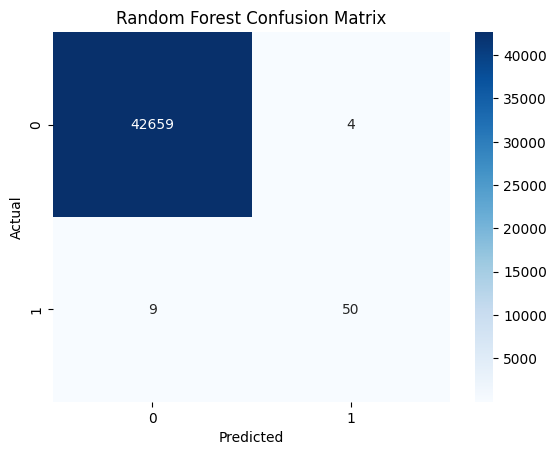
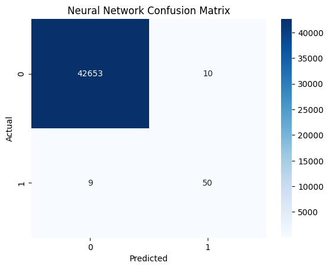
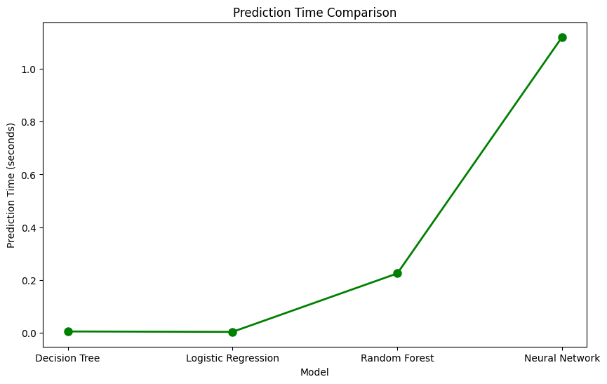
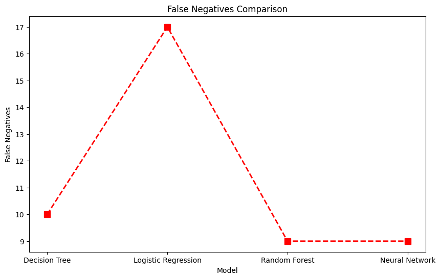
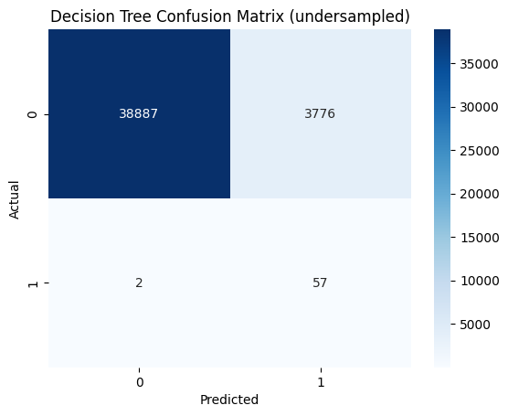
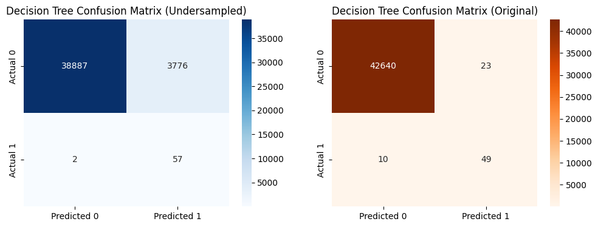
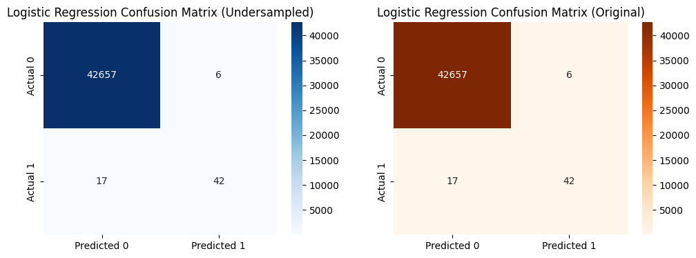
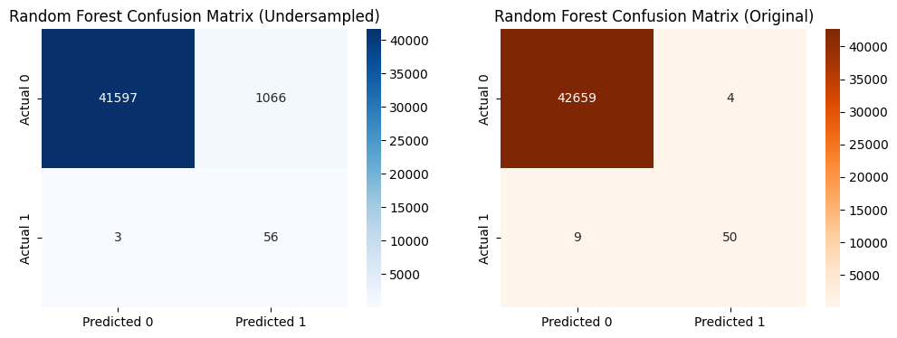
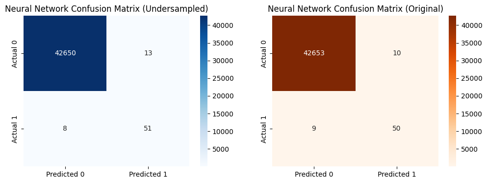
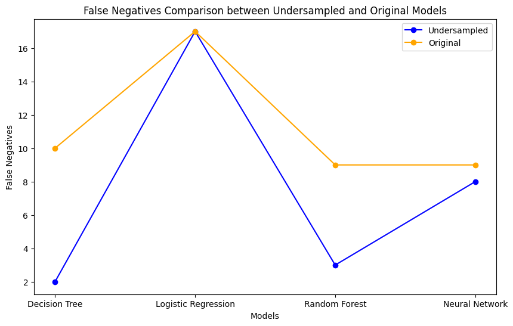

# Data-Mining-Credit-Fraud
### For Data Mining-COMP-7800-01
### By: Brian Zschau

This is a ipython notebook that explores different models and there effectiveness at detecting credit card fraud.

We will be using the dataset found [here](https://www.kaggle.com/datasets/mlg-ulb/creditcardfraud). This dataset has 284,807 tranactions with 492 fradulent transactions making the dataset unbalanced. Due to confidentiality issues the data only containes time and amount columns and the rest of the columns have been transformed using PCA.

I will be doing two experiments, first I will be comparing four different algorithms to see how they do at credit card fraud detection. These algorithms are Decision Trees, Logistic Regression, Random Forest, and Nerual Networks.Next I will be undersampling the data to make it more balanced and seeing if the model preforms better

## Instructions

Tested with Python 11.4 using miniconda

To install the necessary packages run
```
pip install -r requirements.txt
```

In the first cell please replace 'your_username' and 'your_key'
```
os.environ['KAGGLE_USERNAME'] = 'your_username'
os.environ['KAGGLE_KEY'] = 'your_key'
```
with your kaggle username and your kaggle key. This allows you to download the dataset from kaggle. 

This notebook has not been tested on google colab

# Part One:
First we are going to use the raw data. We are going to run the data through 4 different models, 3 classical machine learning algorithms and 1 deep learning algorithm. We will be using Decision Trees, Logistic Regression, Random Forest, and Nerual Networks.

## Results

The models were tested on a dataset with 42722 transactions with predition time being the time to for the model to predict all 42722 transactions.

### Decision Tree

Overall Accuracy: 99.92%  
Prediction Speed: 0.0055 seconds  
False Negatives: 10


### Logistic Regression
Logistic Regression Overall Accuracy: 99.95%  
Logistic Regression Prediction Speed: 0.0040 seconds  
Logistic Regression False Negatives: 17


### Random Forest
Random Forest Overall Accuracy: 99.97%  
Random Forest Prediction Speed: 0.2252 seconds  
Random Forest False Negatives: 9



### Neural Networks
Neural Network Overall Accuracy: 99.96%  
Neural Network Prediction Speed: 1.1201 seconds  
Neural Network False Negatives: 9



### Comparing Results

| Model               |  Accuracy  | Prediction Time (seconds)  | False Negatives  |
|---------------------|------------|----------------------------|------------------|
| Decision Tree       | 99.92%     | 0.0055                      | 10               |
| Logistic Regression | 99.95%     | 0.0040                      | 17               |
| Random Forest       | 99.97%     | 0.2252                      | 9                |
| Neural Network      | 99.96%     | 1.1201                      | 9                |





# Part 2
Undersampling is a technique used in machine learning to address the issue of class imbalance in a dataset. Class imbalance occurs when one class (typically the minority class) has significantly fewer instances than another class (majority class). In the context of binary classification, undersampling involves reducing the number of instances of the majority class to balance it with the minority class. Undersampling involves randomly removing instances from the majority class so that the class distribution becomes more balanced. The goal is to provide the model with a more equal representation of both classes during training.

We are going to undersample the same [dataset](https://www.kaggle.com/datasets/mlg-ulb/creditcardfraud) we used in part one and see if we can imporve the preformance. We will be using the same models so we can do a direct comparison. The main metric we will be looking at is false negatives.

### Decision Tree

Overall Accuracy (undersampled): 91.16%
Prediction Speed (undersampled): 0.0060 seconds
False Negatives (undersampled): 2




### Logistic Regression
Logistic Regression Overall Accuracy (undersampled): 91.16%
Logistic Regression Prediction Speed (undersampled): 0.0037 seconds
Logistic Regression False Negatives (undersampled): 17




### Random Forest
Random Forest Overall Accuracy (undersampled): 97.50%
Random Forest Prediction Speed (undersampled): 0.1842 seconds
Random Forest False Negatives (undersampled): 3




### Neural Networks
Neural Network Overall Accuracy (undersampled): 99.95%
Neural Network Prediction Speed (undersampled): 1.1566 seconds
Neural Network False Negatives (undersampled): 8




### Comparing Results

| Model (undersampled)|  Accuracy  | Prediction Time (seconds)   | False Negatives  |
|---------------------|------------|-----------------------------|------------------|
| Decision Tree       | 91.16%     | 0.0060                      | 2                |
| Logistic Regression | 91.16%     | 0.0037                      | 17               |
| Random Forest       | 97.50%     | 0.1842                      | 3                |
| Neural Network      | 99.95%     | 1.1566                      | 8                |

| Model               | False Negatives (Original)  | False Negatives (Undersampled) | Change |
|---------------------|-----------------------------|--------------------------------|--------|
| Decision Tree       | 10                          | 2                              | -8     |
| Logistic Regression | 17                          | 17                             | 0      |
| Random Forest       | 9                           | 3                              | -6     |
| Neural Network      | 9                           | 8                              | -1     |


